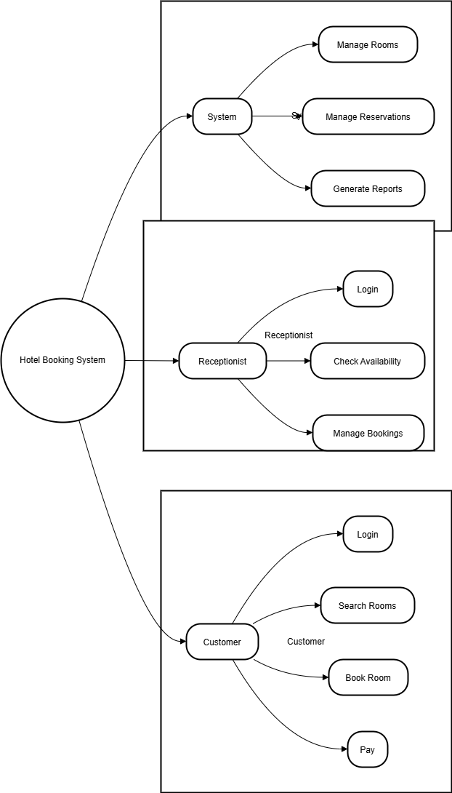

# Requirement Analysis in Software Development

This repository is dedicated to documenting and managing the process of requirement analysis in software development projects. It will include methods, techniques, and tools used for gathering, analyzing, and validating requirements.

## What is Requirement Analysis?

**Requirement Analysis** is the process of gathering, analyzing, and defining the requirements for a software system. It is a critical phase in the **Software Development Life Cycle (SDLC)** that helps ensure the system meets the needs and expectations of its users and stakeholders.

The process involves:
- **Requirement Gathering:** Collecting input from stakeholders through interviews, surveys, and workshops.
- **Requirement Elicitation:** Refining and clarifying the gathered requirements to ensure clarity and completeness.
- **Requirement Modeling:** Organizing and visualizing the requirements to provide a clear picture of how the system will function.
- **Requirement Validation:** Reviewing and confirming the documented requirements with stakeholders to ensure they are correct, complete, and feasible.

**Importance of Requirement Analysis:**
- **Clear Scope Definition:** It helps define the project's scope, ensuring the development team focuses on the right objectives.
- **Stakeholder Alignment:** It ensures the expectations of all stakeholders (clients, end-users, business teams) are clearly understood and met.
- **Prevention of Scope Creep:** By identifying and documenting requirements early, it minimizes the risk of scope changes during development.
- **Foundation for Design and Development:** Accurate requirement analysis serves as the foundation for subsequent phases like system design, implementation, and testing.
- **Risk Reduction:** It helps identify potential issues early, such as ambiguous or unfeasible requirements, reducing the risk of costly changes during later stages.

## Why is Requirement Analysis Important?

Requirement Analysis is a foundational phase in the Software Development Life Cycle (SDLC) that ensures the project delivers the right product. Here are three key reasons why it is critical:

1. **Clarifies Project Scope:**
   - Requirement analysis helps clearly define the project's scope, ensuring that all stakeholders are aligned on what features and functionalities the system will include. This prevents misunderstandings and scope changes during development.

2. **Reduces Risks and Costs:**
   - By identifying potential issues early in the project, such as ambiguous or unrealistic requirements, requirement analysis reduces the risk of costly changes later in the project. It helps avoid project delays and ensures the system can be built within budget.

3. **Improves Stakeholder Communication:**
   - Requirement analysis facilitates better communication between stakeholders, including clients, end-users, and the development team. It ensures that the system is designed to meet user needs and business objectives, increasing the likelihood of project success.

Accurate and thorough requirement analysis is vital to building a successful software system that satisfies user expectations, is delivered on time, and is within budget.

## Key Activities in Requirement Analysis

Requirement analysis is a process that involves several key activities to ensure that the system being developed meets the needs of the stakeholders. The five key activities involved in Requirement Analysis are:

- **Requirement Gathering:**
  - In this initial step, information is collected from stakeholders (clients, users, and business teams) using techniques like interviews, surveys, and workshops. The goal is to understand what the system is expected to achieve.

- **Requirement Elicitation:**
  - This activity refines and elaborates on the gathered requirements. It involves clarifying and prioritizing the requirements through various techniques such as prototyping and brainstorming sessions to ensure they are actionable and complete.

- **Requirement Documentation:**
  - During this phase, the gathered and elicited requirements are formally documented. The documentation may include use cases, user stories, functional specifications, and other relevant details that describe how the system should function.

- **Requirement Analysis and Modeling:**
  - This involves organizing and structuring the requirements in a way that provides a clear understanding of the system’s functionality. It includes creating models such as use case diagrams, data flow diagrams, and entity-relationship diagrams to represent the requirements visually.

- **Requirement Validation:**
  - The final activity is to review and validate the documented requirements with stakeholders to ensure that they are accurate, feasible, and complete. This step helps to avoid misunderstandings or missed requirements and ensures that the system will meet the users' needs.

These activities help create a clear understanding of what the system needs to do, ensuring that the development process stays on track and delivers a product that meets expectations.

## Types of Requirements

Requirements in software development can be categorized into **Functional Requirements** and **Non-functional Requirements**. These requirements define what the system should do and how well it should perform.

### Functional Requirements
**Functional requirements** describe the specific features and functions that the system must perform. These are the core features that directly support the user’s needs and interactions with the system.

**Examples for a Hotel Booking System:**
- **User Registration and Authentication:**
  - The system must allow users to create accounts, log in, and securely authenticate using credentials such as email and password.
- **Hotel Search Functionality:**
  - Customers should be able to search for available hotels based on various criteria like location, price range, amenities, and check-in/check-out dates.
- **Booking and Payment:**
  - Customers must be able to book a hotel room and process payments securely using a third-party payment service (e.g., credit card, PayPal).
- **Hotel Management:**
  - Hotel managers must be able to add, update, or delete hotel listings, update room availability, and set pricing.

### Non-functional Requirements
**Non-functional requirements** define how the system performs and its operational characteristics. These are qualities that determine the system’s performance, security, reliability, and scalability.

**Examples for a Hotel Booking System:**
- **Performance:**
  - The system should be able to handle up to 1,000 concurrent users without degradation in performance, and search results should be returned in under 2 seconds.
- **Scalability:**
  - The system must be designed to scale horizontally, with the ability to add more servers as the user base grows.
- **Security:**
  - User data, including payment information, must be encrypted and stored securely to prevent unauthorized access or data breaches.
- **Availability:**
  - The system should have a 99.9% uptime, ensuring it is available most of the time and that any downtime for maintenance is minimal.
- **Data Consistency and Durability:**
  - The hotel booking and user data must be consistent across all services and stored in reliable databases such as Cassandra for historical data and Redis for caching.

## Use Case Diagrams

### What are Use Case Diagrams?
Use Case Diagrams are a graphical representation of the interactions between users (actors) and a system. They visually depict the system's functionality from the user's perspective. Use Case Diagrams help clarify the requirements and the relationships between users and system components, offering a clear overview of what the system should do.

### Benefits of Use Case Diagrams:
- **Simplified Communication:** They make it easier to communicate system functionalities to both technical and non-technical stakeholders.
- **Requirement Clarification:** They help ensure that all system requirements are understood and agreed upon by stakeholders.
- **Identify System Boundaries:** They highlight what is inside and outside the system’s scope, aiding in the design process.

Below is the Use Case Diagram for the Hotel Booking System, showing key actors and their interactions with the system.

